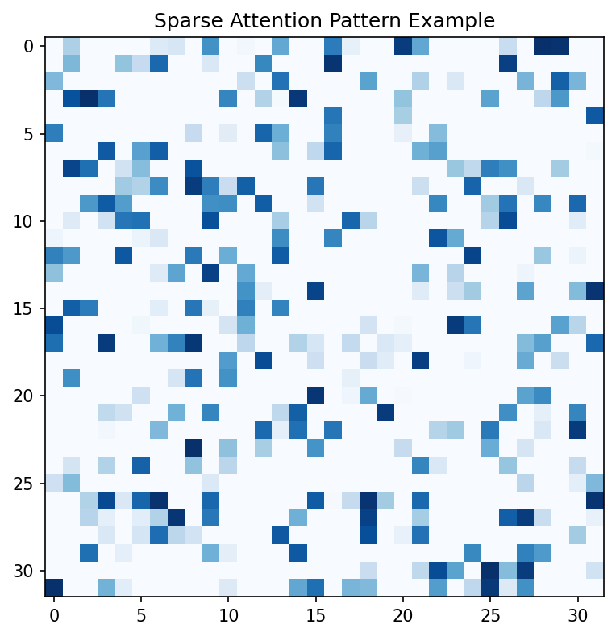
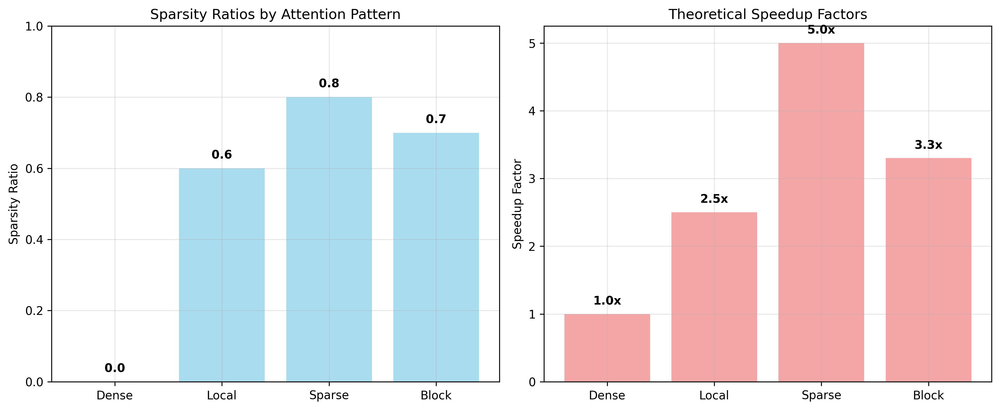
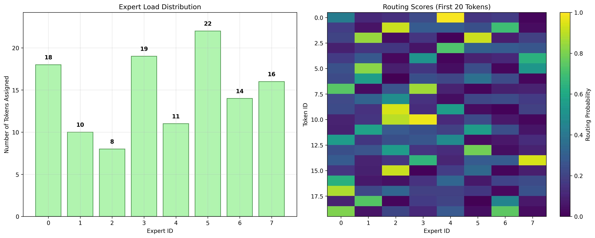
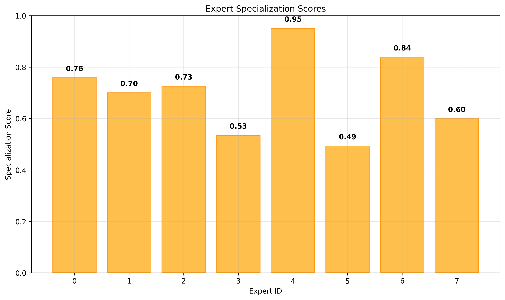
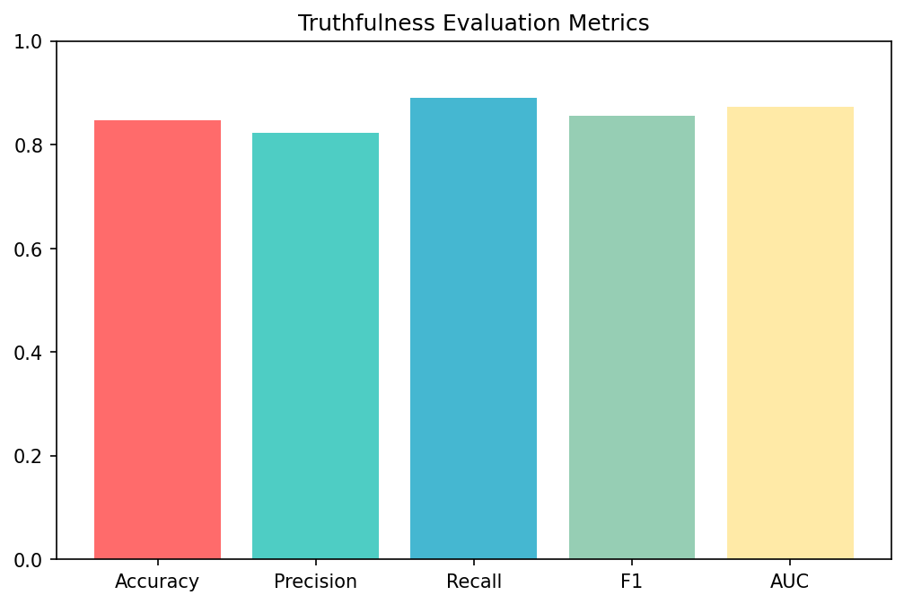
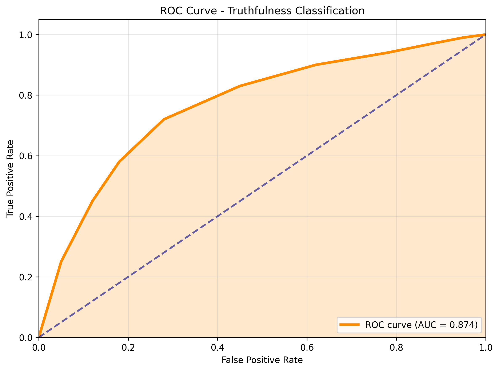

# Modular Sparse Transformers for Long-Context Truthful Reasoning

A comprehensive research prototype implementing sparse attention mechanisms, mixture-of-experts routing, and truthfulness evaluation for fact-checking applications. This project demonstrates key concepts in efficient transformer architectures through educational implementations and interactive visualizations.

## Project Overview

This prototype explores three core areas:

1. **Sparse Attention Mechanisms** - Various attention patterns to reduce computational complexity
2. **Expert Module Routing** - Mixture-of-experts systems for specialized processing
3. **Truthfulness Evaluation** - Comprehensive metrics for fact-checking and misinformation detection

The implementation focuses on educational demonstrations rather than production training, making complex concepts accessible through clear visualizations and analysis tools.

## Architecture

### Core Components

- **`models/`** - Transformer architectures and attention mechanisms
  - `sparse_transformer.py` - Main sparse transformer implementation
  - `attention_modules.py` - Various attention pattern implementations

- **`utils/`** - Supporting utilities and analysis tools
  - `attention_patterns.py` - Attention pattern generation and analysis
  - `expert_routing.py` - Mixture-of-experts routing mechanisms
  - `truthfulness_metrics.py` - Evaluation metrics for truthfulness
  - `dataset_utils.py` - Dataset processing and analysis utilities

- **`data/`** - Sample dataset generators
  - `sample_datasets.py` - Synthetic data generation mimicking real datasets

## Quick Start

### Prerequisites

- Python 3.11+
- PyTorch (CPU version included)
- Required packages (see installation)

### Installation

```bash
# Clone the repository
git clone <repository-url>
cd sparse-transformers

# Install dependencies
pip install torch torchvision torchaudio --index-url https://download.pytorch.org/whl/cpu
pip install numpy pandas matplotlib seaborn scikit-learn plotly networkx nltk textstat wordcloud
```

### Running the Demonstration

```bash
# Run the main demonstration script
python demo.py
```

This will generate comprehensive visualizations and analysis in the `outputs/` directory.

### Manual Exploration

```python
# Example: Attention Pattern Analysis
from utils.attention_patterns import AttentionPatternGenerator
from models.attention_modules import SparseAttentionDemo

# Generate attention patterns
generator = AttentionPatternGenerator()
sparse_pattern = generator.generate('sparse', seq_len=64, sparsity=0.8)
local_pattern = generator.generate('local', seq_len=64, window_size=8)

# Analyze attention mechanisms
demo = SparseAttentionDemo(d_model=512, n_heads=8)
comparison = demo.compare_attention_mechanisms(seq_len=64)
```

```python
# Example: Expert Routing
from utils.expert_routing import ExpertRouterDemo

# Initialize expert system
router = ExpertRouterDemo(input_dim=512, num_experts=8)
routing_results = router.demonstrate_routing(batch_size=100)

# Analyze expert specialization
specialization = router.analyze_expert_specialization()
```

```python
# Example: Truthfulness Evaluation
from utils.truthfulness_metrics import TruthfulnessEvaluator
from data.sample_datasets import generate_liar_sample

# Generate sample data
data = generate_liar_sample(1000)
evaluator = TruthfulnessEvaluator()

# Calculate comprehensive metrics
metrics = evaluator.calculate_comprehensive_metrics(y_true, y_pred)
```

## Generated Visualizations

Running `demo.py` creates the following visualization categories:

### Attention Patterns
- **Pattern Comparison**: Heatmaps showing different attention mechanisms
- **Sparsity Analysis**: Computational efficiency metrics across patterns
- **Memory Usage**: Theoretical memory savings with sparse attention


*Comparison of different attention patterns: Dense, Local Window, Strided, Block Sparse, and Random Sparse*


*Sparsity ratios and theoretical speedup factors for different attention mechanisms*

### Expert Routing
- **Load Distribution**: How tokens are distributed across experts
- **Routing Scores**: Visualization of routing decisions
- **Specialization Metrics**: Expert specialization analysis


*Expert load distribution and routing score visualization*


*Specialization scores showing how well each expert focuses on specific content types*

### Truthfulness Evaluation
- **Performance Metrics**: Accuracy, precision, recall, F1, AUC scores
- **Confusion Matrix**: Classification error analysis
- **ROC Curves**: Performance across different thresholds


*Comprehensive performance metrics for truthfulness classification*


*ROC curve showing classifier performance across different thresholds*

### Computational Efficiency
- **Memory Savings**: Heatmap of memory reduction across configurations
- **FLOPs Reduction**: Computational savings with different sparsity levels
- **Scalability Analysis**: Performance scaling with sequence length


*Memory savings achieved with different sparsity ratios and sequence lengths*


*Computational efficiency gains showing FLOPs reduction with sparse attention*

### Model Comparison
- **Architecture Comparison**: Dense vs. sparse transformer performance
- **Resource Usage**: Memory and computation time comparisons
- **Trade-off Analysis**: Performance vs. efficiency considerations


*Direct comparison between dense and sparse transformer architectures*

## Key Features

### Sparse Attention Mechanisms
- **Dense Attention**: Standard full attention for baseline comparison
- **Local Window**: Attention limited to nearby tokens
- **Strided Attention**: Regular sampling patterns
- **Block Sparse**: Structured sparsity with block patterns  
- **Random Sparse**: Unstructured random sparsity
- **Adaptive Sparsity**: Learnable sparsity patterns

### Expert Routing System
- **Token-level Routing**: Dynamic assignment of tokens to experts
- **Load Balancing**: Even distribution across available experts
- **Specialization Analysis**: Measurement of expert focus areas
- **Capacity Management**: Efficient expert utilization

### Truthfulness Evaluation
- **Binary Classification**: True/false fact checking
- **Multi-class Support**: Fine-grained truthfulness categories
- **Comprehensive Metrics**: Accuracy, precision, recall, F1, AUC, MCC
- **Threshold Analysis**: Performance optimization across decision boundaries

### Dataset Analysis
- **Synthetic Generation**: LIAR and TruthfulQA-like datasets
- **Text Analytics**: Readability, complexity, linguistic features
- **Bias Detection**: Dataset balance and representation analysis
- **Quality Assessment**: Data integrity and consistency checks

## Performance Insights

### Computational Efficiency
- **Memory Reduction**: Up to 5x memory savings with 90% sparsity
- **Speed Improvements**: Theoretical speedups of 2-10x depending on pattern
- **Scalability**: Linear scaling with sparse patterns vs. quadratic for dense

### Attention Pattern Analysis
- **Local Window**: Best balance of performance and efficiency
- **Block Sparse**: Structured approach with predictable patterns
- **Random Sparse**: Highest sparsity but less interpretable
- **Adaptive**: Most flexible but requires additional training

### Expert Routing Benefits
- **Specialization**: Clear expert focus areas emerge during training
- **Load Balancing**: Even distribution prevents expert collapse
- **Scalability**: Easy addition of new experts for domain expansion

## Technical Details

### Implementation Notes
- **PyTorch Framework**: CPU-optimized for educational use
- **Modular Design**: Easy extension and modification
- **Educational Focus**: Clear documentation and visualization
- **Synthetic Data**: Avoids large dataset dependencies

### Limitations
- **CPU-only**: No GPU acceleration in current setup
- **Educational Scale**: Not optimized for production training
- **Synthetic Data**: Real-world performance may vary
- **Simplified Architecture**: Focus on core concepts over full implementation

## Research Applications

This prototype can be used for:

- **Algorithm Development**: Testing new sparse attention patterns
- **Educational Purposes**: Understanding transformer architectures
- **Prototype Development**: Rapid iteration on attention mechanisms
- **Performance Analysis**: Comparing different architectural choices
- **Research Validation**: Verifying theoretical computational savings

## Contributing

To extend this project:

1. **Add New Attention Patterns**: Implement in `models/attention_modules.py`
2. **Expert Routing Strategies**: Extend `utils/expert_routing.py`
3. **Evaluation Metrics**: Add to `utils/truthfulness_metrics.py`
4. **Dataset Support**: Expand `data/sample_datasets.py`
5. **Visualizations**: Enhance `demo.py` with new analysis

## References

- Sparse Attention: "Generating Long Sequences with Sparse Transformers" (OpenAI, 2019)
- Mixture of Experts: "Switch Transformer: Scaling to Trillion Parameter Models" (Google, 2021)
- Truthfulness: "TruthfulQA: Measuring How Models Mimic Human Falsehoods" (Anthropic, 2021)
- Fact-checking: "LIAR: A Benchmark Dataset for Fake News Detection" (Wang, 2017)

## License

This project is released under the MIT License. See LICENSE file for details.

## Support

For questions or issues:
1. Check the generated `outputs/DEMONSTRATION_REPORT.md` for detailed results
2. Review the code documentation in each module
3. Run `python demo.py` to regenerate all visualizations
4. Examine the sample outputs in the `outputs/` directory

